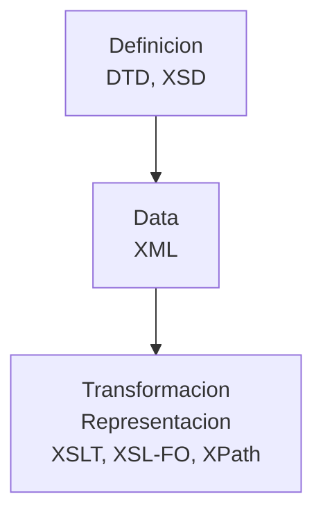

# E-Invoice

[](https://builtwithnix.org)

## 🚀 Project Structure

You'll see the following folders:

```

.
├── bench/  # excluded from vs, put all your wip files, examples, test files here
├── nix/    # nix code setting up the environment for you
├── xslt/   # compiled validation models from official "caja de herramientas"
├── gc/     # genericode lists of values from official "caja de herramientas"
└── ...
```

## 🐚 Devshell

This repository is equiped with a development envionment. You'll need:

- [Nix](https://nixos.org/download)
- [Direnv](https://direnv.net/docs/installation.html)

On first use, instruct direnv to trust the configuration with `direnv allow`.

This will drop you into a fully equipped development environment with all dependencies and utilities that you'll need at hand.

## 🧞 Commands

All commands are run from the root of the project, from a terminal:

| Command                    | Action                                           |
| :------------------------- | :----------------------------------------------- |
| `saxon-he -s:bench/<my-document>.xml -xsl:xslt/DIAN-UBL21.xsl`  | Validate an E-Document from the bench folder |

## 👀 Embed into program?

Due to the state of XML tooling, which is mainly limited to Java \*, I found it best to just call out to the binary from within your code.

\* In fact, `saxon-he` (Home Edition) was the only open source tool with which I was able to validate an XML against the provided XSL.

_exaples may follow - PRs welocome_

## XML, DTD, XSD, XSL, XSLT, XSL-FO & XPath

Traduccion de: https://www.digicomp.ch/blog/2017/07/04/xml-dtd-xsd-xsl-xslt-xsl-fo-und-xpath-im-uberblick

### En primer lugar, XML

XML es la abreviatura de eXtensible Markup Language (lenguaje de marcado extensible) y se caracteriza por las tres propiedades siguientes:

- Contiene datos
- Estructurados y jerárquicos
- Así como almacenados en forma de texto

**Mnemotecnia:**

> "XML describe lo que tenemos de forma estructurada".

### DTD: averigüe si lo ha hecho "bien" o no

Por supuesto, errata son totalmente inviable si el documento XML se va a procesar electrónicamente.
Pero, ¿cómo puedo encontrar esos errores? Utilicemos DTD (Document Type Definition).
Las DTD son, por así decirlo, los planos de los documentos XML. Estos planos -o especificaciones de construcción- contienen instrucciones sobre qué elementos pueden aparecer en un archivo XML, cómo pueden anidarse unos dentro de otros y qué atributos pueden, pueden o deben tener.

**Mnemotecnia:**

> "DTD define el 'plano de construccion' simple de un archivo XML".

### Bien, ¿qué es XSD?

XSD son las siglas de "XML Schema Definition" (definición de esquema XML). Una definición de esquema es, en realidad, la misma idea que una DTD, pero con increíbles ventajas prácticas. He aquí algunas de ellas:
Un archivo XSD también se escribe en XML (a diferencia de un DTD)
En XSD se pueden definir más tipos de datos.
Se pueden definir restricciones en XSD
Para explicarlo un poco, el valor del atributo "peso", por ejemplo, puede restringirse a un número entero entre 0 y 2000. Esto no es posible con una DTD.

**Mnemotecnia:**

> "XSD define el detallado y complejo 'plano' de un archivo XML".

### Hacer algo con los datos

Normalmente lo que quieres es hacer algo con los datos. Entonces entra en juego XSL (Extensible Stylesheet Language).
El término XSL combina tres subtérminos:

- XSL-FO: lo que se encuentra en la configuración de la impresora en "Configuración de página", por así decirlo.
- XPath: el lenguaje "Por favor, encuentre algo en un documento XML
- XSLT: donde la "T" significa "transformación".
  Un breve ejemplo de cada término.

#### El XSL-FO

Los objetos de formato XSL (abreviado XSL-FO) se utilizan para definir todo lo necesario para la salida, ya sea en papel, en pantalla o incluso a través de un software de lectura. Entre otras cosas, XSL-FO se utiliza para definir cómo debe dividirse una página y qué tamaño debe tener.

#### El XPath

El "path" en "XPath" puede traducirse fácilmente al español como "camino".Y efectivamente, una expresión XPath describe algo así como la ruta de acceso a los datos deseados en el archivo XML.

#### El XSLT

XSLT puede utilizarse para transformar XML en otra cosa. Por ejemplo, en HTML.

### Resumen


